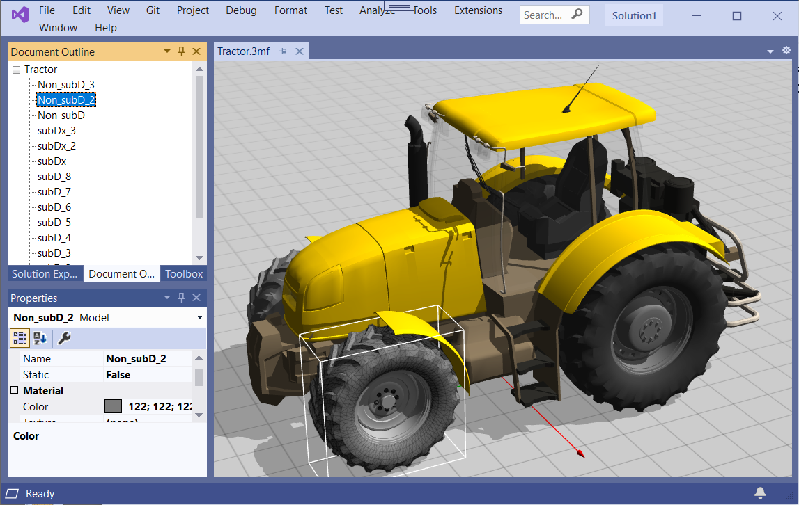
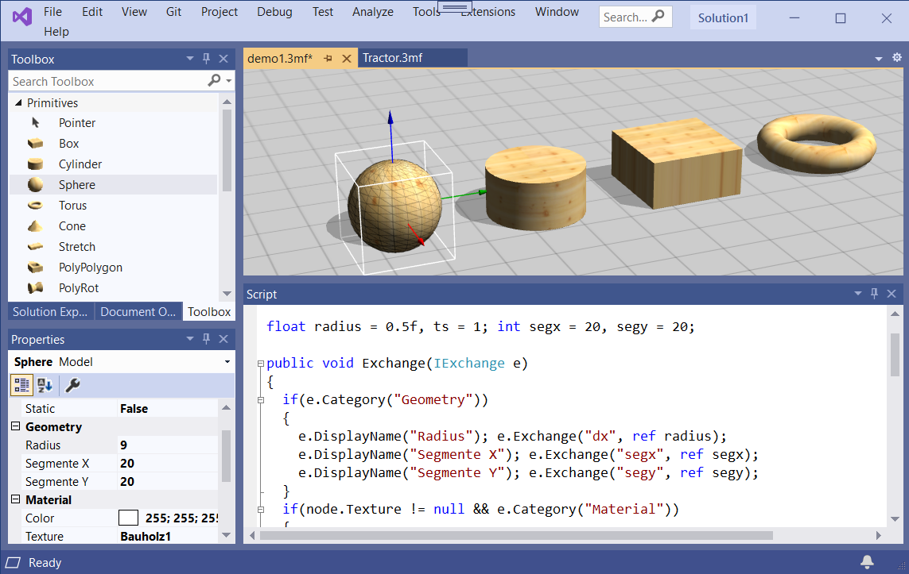
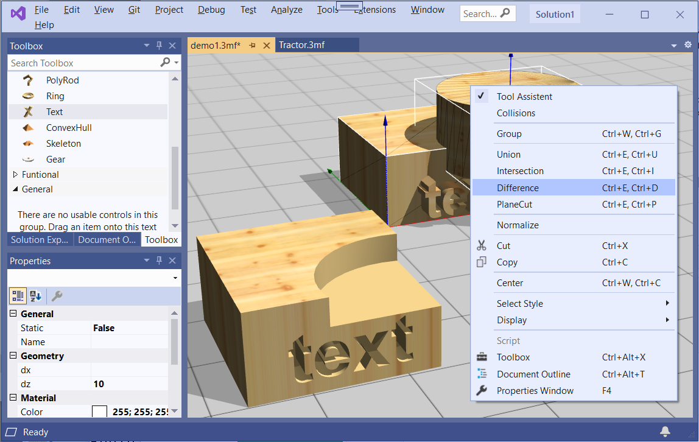
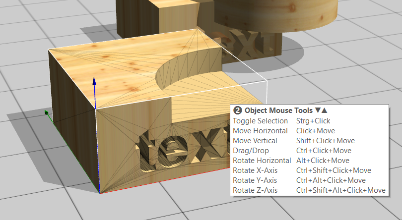

# Apex-VSIX Visual Studio Plugin for 3D modeling
First of all, as a Visual Studio plug-in, Apex-VSIX allows you to load, view, explore, edit, recombine and save 3D models as 3MF files directly in the Visual Studio IDE.  
After installation as Extension it is possible to open existing 3MF files by Open File or simply by drop it in the IDE. 
As 3D resources 3MF Files can also be part of VS Projects and the tool allows easily to manage the content.
The central 3D View works close together with the common Tool windows like, Properties, Document Outline, the Toolbox, a special Script Editor, Output and the Solution Explorer as well.



## Scripts
Something new is that it is possible to define 3MF models very flexibly with small C# like scripts. 
Based on parameters that are defined in the scripts and a exchange interface, that allows to edit such parameters external via NET Component Model, it is possible to define complex and very specialized objects. 
This means the calculation of the polygon nets is done by the scripts based on the parameters. 
Fortunately the 3MF document model, internal based on XML, is very flexible at this point and allows to save such extra information in additional namespaces.
The intelligence can be in the 3MF objects itself. It does not need specialized software or extensions to install to support special objects needed for specific solutions. 
For some simple Primitives form the Toolbox it looks like this:



## A Hello World Code snippet could be:

```C#
float dx = 10, dy = 10; //Parameters as Width and Height
 
public void Exchange(IExchange e)
{
  if(e.Category("Geometry")) //Display Category in the Properties view
  { 
    e.Exchange("dx", ref dx); //Property Width to save, restore, display and edit
    e.Exchange("dy", ref dy); //Property Height to save, restore, display and edit 
    if(e.Modified) //Is modified calculate a simple rectangle:
    {
      var pp = new float3[] { (0, 0, 0), (dx, 0, 0), (dx, dy, 0), (0, dy, 0) };
      var ii = new ushort[] { 0, 1, 2, 0, 2, 3};
      node.SetMesh(pp, 4, ii, 6);
   }
  }
}
```

## For the scripts: 
This is not C# or based on the .NET CodeDom C# compiler. 
The problem with CodeDom compilers is that they always create fully qualified assemblies that cannot be removed from memory at runtime. 
In a solution like this, with many dynamic objects at runtime, speed and memory problems would quickly arise. In addition, these compilers are also not that fast.

The solution was a own compiler that translate C# code to System.Linq.Expressions. It generates Delegates based internal on System.Reflection.Emit.DynamicMethodes and these methods can be collected.
At this point the scripts are limited, there are the restrictions from the Expressions and Generic Delegates itself.
On the other hand priority was speed, fast as possible compilation, only support for the really necessary code syntax. No try...catch, no using, no while(x) as it can be written as for(;x;), no class, no struct etc.
But full support for Linq and inline delegates and support for ValueTuple as it can be used to bypass struct and class definitions.
It means Script code can copied and used in C# without changes but this is limited in the other direction.

## Object Modeling

Part of the Solution is a Geometry Engine for advanced Mesh object calculation. Polygon Tessellation, general Mesh generation, Algorithms like Convex Hull and Skeleton, Boolean Mesh Operation like Union, Intersection and Difference are supported.
All these functionality can be used from scripts to build complex models as shown in some examples from the toolbox.
It is also possible to use functions like the Boolean Mesh Operation in the 3D View:



The Geometry Engine, written in C++ and accessible  over COM, internal calculates if necessary with rational arithmetic to solve robustness problems. 
Therefore in the interface is a special Variant Type for exchange what allows to work with different precessions.

## Toolbars



Instead of ugly toolbars, of which there are enough in Visual Studio, I have built in a Tool Assistant solution.
This is nothing else than a Tooltip how shows on several pages witch tools are possible at the current mouse position in combination with key combinations.
What is possible is very dynamic and depends on the object states, control points, lines and arrows, background etc. where the mouse is over.
When it nerves: This Tooltip can easily enabled/disabled by press Enter.
